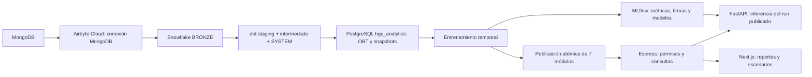

# HGC — plataforma analítica

Sistema existente ampliado con un circuito reproducible de datos, entrenamiento e inferencia. El chat y los modelos dimensionales/de hechos de PowerBI permanecen fuera del alcance de estos cambios.

## Arquitectura

PostgreSQL es la capa de serving: las pantallas y las predicciones no consultan Snowflake. Las cargas batch leen las OBT SYSTEM una vez, comprueban contratos, calculan huellas SHA-256 y reemplazan el snapshot en una transacción. Una carga idéntica conserva su identificador. El entrenamiento lee un snapshot consistente y publica todos los módulos juntos; un fallo conserva la publicación anterior. La inferencia carga el `run_id` de esa publicación, incluso si existen versiones experimentales posteriores en MLflow.

## Organización

- `dbt/models/system`: cinco OBT para ventas, pedidos identificados, cohortes de clientes, costos mensuales y producto/semana.
- `dbt/tests`: granos, medidas, reconciliación de costos, fechas y madurez de etiquetas.
- `hgc-ml/data`: extracción, contratos y publicación transaccional.
- `hgc-ml/training`: modelos reutilizables y trazabilidad MLflow.
- `hgc-ml/serving`: API de inferencia autenticada, sin reentrenar por petición.
- `hgc-ml/notebooks`: cuatro experimentos ejecutables que usan el mismo código de producción.
- `hgc-back/src/analytics`: permisos, validación, consultas paginadas y proxy de inferencia.
- `hgc-front/components/analytics`: componentes compartidos y controles de predicción interactiva.
- `airflow/dags`: orquestación; infraestructura LocalExecutor + PostgreSQL, sin Redis/Celery.
- `scripts`: verificaciones y ejecución de notebooks.

## Operación

Ver [guía de operación](docs/operations.md) y [contratos y modelos](docs/models.md). Las credenciales se completan localmente a partir de los `.env.example`; los `.env`, modelos binarios, paquetes dbt y compilados no se versionan.

Servicios locales: aplicación `http://localhost:3000`, API `http://localhost:4000`, MLflow `http://localhost:5000`, inferencia `http://localhost:8000/health`, Airflow `http://localhost:8080`. Los puertos de MLflow, inferencia y Airflow se limitan al host local.
